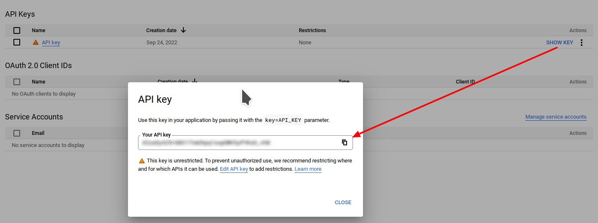
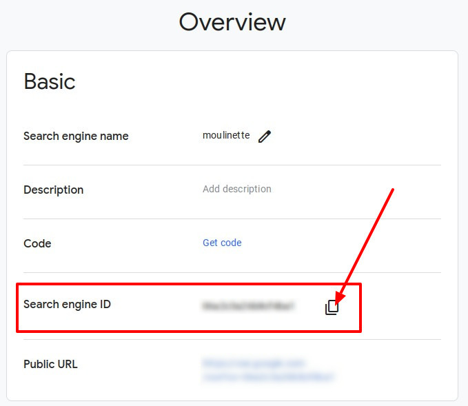

# Moulinette Forge Image Search (Foundry VTT)

This is a submodule for [Moulinette Core](https://github.com/SvenWerlen/moulinette-core). See [Moulinette Core](https://github.com/SvenWerlen/moulinette-core) for an overview of all modules.

## Search image and generate article

You need images to enrich your game/campaign ?
* Search using <a href="https://www.bing.com" target="_blank">Microsoft Bing</a>, <a href="https://www.google.com" target="_blank">Google Search</a> or <a href="https://search.openverse.engineering/" target="_blank">Openverse Search</a> engines.
* Preview the image
* Download or generate a journal article
* Forge!

 _(Images on the screenshot are from [Microsoft Bing](https://www.bing.com) search engine. Images are publicly available but their license varies.)_

## <a name="configure"/>Generate your own API key and Engine ID for Google Search

The module requires a valid API key and Engine ID for using Google Search. You'll have to create a Google Cloud account and a create a new project. The 100 first search queries per day are free. However, Moulinette always executes 3 queries in order to get 30 results. That means that only the first 33 moulinette searches per day will be free while using Google Search.

* Visit https://console.developers.google.com and create a project.
* Visit https://console.developers.google.com/apis/library/customsearch.googleapis.com and enable "Custom Search API" for your project.
* Visit https://console.developers.google.com/apis/credentials and generate API key credentials for your project.
* Copy the API key and paste it as Google Search API key (module's configuration)
* Visit https://cse.google.com/cse/all and in the web form where you create/edit your custom search engine enable "Image search" option and for "Sites to search" option select "Search the entire web but emphasize included sites".
* Copy the Search engine ID and paste it as Google Search Engine ID (module's configuration)
* Voilà!

## <a name="configure"/>Generate your own API key for Bing Search

The module requires a valid API key for using Bing Search. You'll have to create a Microsoft Azure account and a create a new service. The "Free" Tier provides you 1000 requests per month for free.

The following steps assume that you have a basic undestanding of Microsoft Azure and assumes that you already created a subscription
* From the dashboard / home page, click on "Create a resource"
* In the search bar, search for "Bing Search" and select "Bing Search v7"
* Click "Create"
  * Enter a name for your service
  * Select your existing subscription
  * Choose a pricing tier according to your needs (Free tier should fit in most cases)
  * Choose an existing Resource Group or create a new
  * Check the box to confirm conditions
  * Create
* Go to the resource after it has been created
  * Select "Key and EndPoint"
  * Copy one of the two keys (doesn't matter, both will work)
* In Foundry VTT, under "Configure Settings", specify your key for the "Bing Search API key"
* Voilà!

## <a name="install"/>Install the module

To **install** the module from FoundryVTT:
1. Start FVTT and browse to the Game Modules tab in the Configuration and Setup menu
2. Search for "Moulinette Forge" and click install on the desired module

To **manually install** the module (not recommended), follow these instructions:

1. Start FVTT and browse to the Game Modules tab in the Configuration and Setup menu
2. Select the Install Module button and enter the following URL: https://raw.githubusercontent.com/svenwerlen/moulinette-imagesearch/master/module.json
3. Click Install and wait for installation to complete 

## <a name="support"/>Support me on Patreon

If you like my work and want to support me, consider becoming a patreon!

[https://www.patreon.com/moulinette](https://www.patreon.com/moulinette)

You can also join [Moulinette Discord](https://discord.gg/xg3dcMQfP2)
